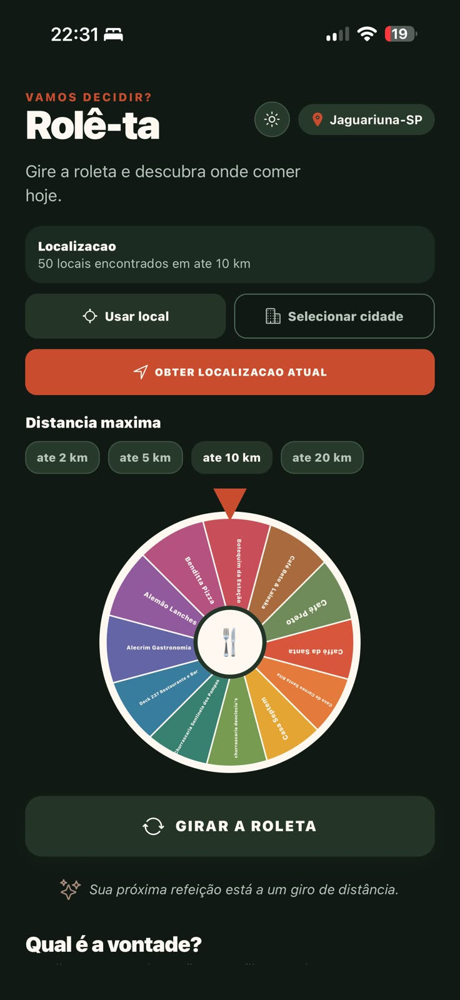
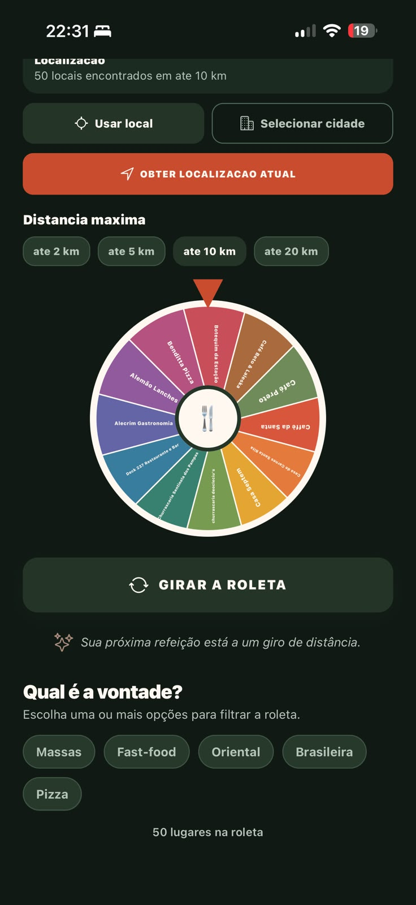

# 🍽️ Rolê-ta

> **Stop debating. Start eating.**

Rolê-ta is a mobile application that helps users decide where to eat by discovering nearby restaurants and randomly selecting one based on their preferences.

Instead of spending time discussing where to go, simply spin the roulette and let Rolê-ta choose your next meal.


---

## 📱 Preview


<p align="center">
  
  
</p>

<p align="center">
  <strong>Home Screen</strong> &nbsp;&nbsp;&nbsp;&nbsp;&nbsp;&nbsp;&nbsp;&nbsp;
  <strong>Restaurant Filters</strong>
</p>
---

## ✨ Features

- 📍 Current location detection

- 🎲 Restaurant roulette

- 🍕 Restaurant category filters

- 📏 Custom search radius

- 🌙 Modern dark interface

---

## 🛠️ Tech Stack

| Technology    | Purpose              |
| ------------- | -------------------- |
| React Native  | Mobile Application   |
| Expo          | Development Platform |
| TypeScript    | Type Safety          |
| Expo Router   | Navigation           |
| Expo Location | GPS                  |

---

## 🚀 Getting Started

```bash
git clone https://github.com/renanvty/role-ta.git

cd role-ta

npm install

npx start
```

---

## 💡 Why I Built This

Choosing where to eat shouldn't take longer than eating itself.

Rolê-ta was born from a very common situation: groups of friends spending several minutes deciding where to eat.

The goal is simple: make the decision fast, fun and effortless.

---

## 🗺️ Roadmap

### Current

- [x] Restaurant roulette

- [x] Current location

- [x] Restaurant filters

- [x] Search radius

### Planned

- [ ] Favorites

- [ ] Restaurant details

- [ ] History

- [ ] User authentication

- [ ] Python Backend

- [ ] PostgreSQL

- [ ] AI Recommendations

---
## 📈 Learning Journey

This project is being continuously improved as I learn Backend Software Engineering.

Each new feature represents a new concept or technology explored during my learning journey.

The goal isn't just to build an app, but to continuously improve it following real-world software engineering practices.

---

## 👨‍💻 Author

**Renan Alves Ramos**

Backend Software Engineering Student

Senior Digital Content Management Analyst @ Accenture

🔗 GitHub

🔗 LinkedIn

---


## 📌 Status

🚧 Currently under active development.

New features are continuously being added as part of my Backend Software Engineering learning journey.

---

## 📄 License

MIT License
